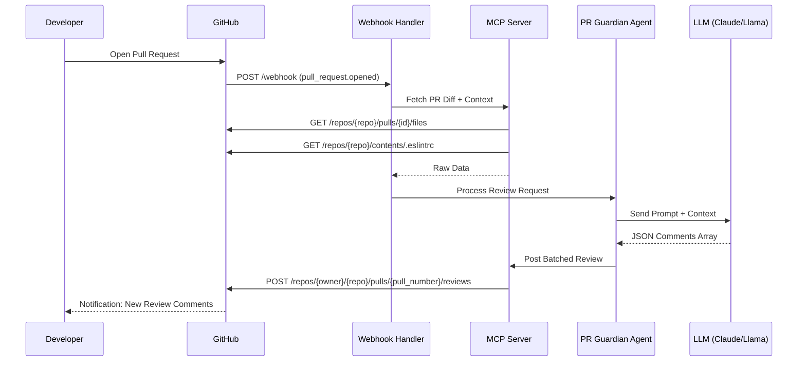
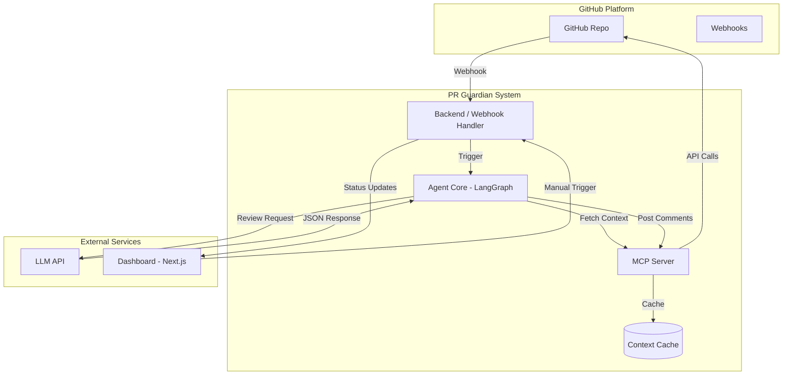
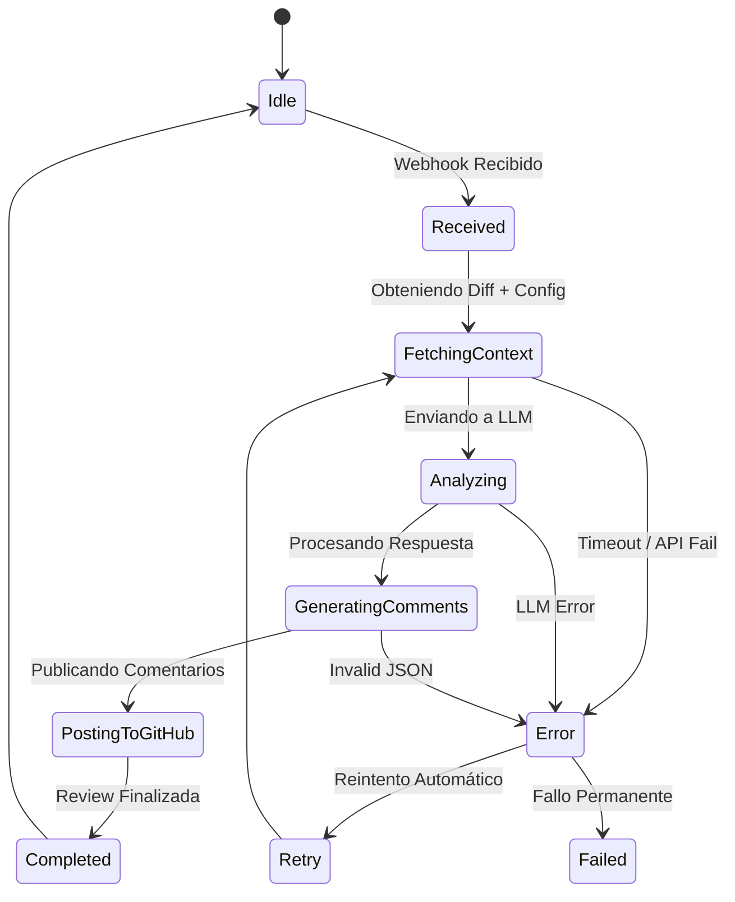

# ️ PR Guardian - Documentación de Arquitectura y Diagramas

Este documento explica los diagramas técnicos del proyecto PR Guardian. Úsalos como referencia durante el desarrollo y para preparar el pitch técnico ante los jueces.

---

## 1. Diagrama de Flujo Principal (Secuencia)

### Descripción
Este diagrama muestra la **interacción temporal** entre los actores cuando se abre un Pull Request. Es la vista "paso a paso" de lo que ocurre desde que el developer hace push hasta que recibe feedback.

### Explicación Detallada
1.  **Trigger:** El desarrollador abre un PR en GitHub. Esto es el evento inicial.
2.  **Webhook:** GitHub envía una notificación HTTP POST a nuestro servidor (`Webhook Handler`). Este es nuestro punto de entrada real.
3.  **Context Fetching:** El handler no analiza nada todavía. Primero le pide al `MCP Server` que obtenga el diff del PR, las reglas de estilo (.eslintrc) y el historial reciente.
4.  **Análisis:** Con todos los datos crudos, el `Agent Core` construye el prompt y se lo envía al LLM.
5.   **Respuesta Estructurada:** El LLM devuelve JSON con comentarios inline (no texto libre). El JSON garantiza el formato, no la verdad: cada hallazgo se valida después contra archivo, línea, evidencia y head_sha antes de publicarse.

6.  **Publicación:** El MCP toma ese JSON y crea comentarios reales en las líneas específicas del PR en GitHub.
7.  **Notificación:** GitHub avisa al developer que hay nuevos comentarios.

### 💡 Por qué importa para ganar
-   Demuestra que entendemos **event-driven architecture**.
-   Muestra que el agente no "adivina", sino que **consulta contexto explícito** antes de opinar.
-   Justifica por qué usamos MCP: para separar la lógica de negocio (agente) de la integración con APIs externas (GitHub).

---

## 2. Diagrama de Arquitectura de Componentes

### Descripción
Esta es la vista **estructural estática**. Muestra cómo están organizados los módulos del sistema, sus responsabilidades y cómo se comunican entre sí. Es el mapa de tu monorepo.

### Explicación Detallada
-   **GitHub Platform (Izquierda):** Es el entorno externo. No lo controlamos, pero nos provee los eventos (webhooks) y el destino final (comentarios en PR).
-   **PR Guardian System (Centro - Nuestro Código):**
    -   `Backend/Webhook Handler`: El recepcionista. Valida firmas, parsea payloads, dispara procesos async.
    -   `MCP Server`: El traductor universal. Convierte llamadas de API de GitHub en herramientas que el LLM puede usar. También maneja caché de contexto.
    -   `Agent Core (LangGraph)`: El cerebro. Orquesta el flujo de pensamiento, decide cuándo buscar más info, valida respuestas.
    -   `Context Cache`: Memoria a corto plazo. Guarda configs y PRs recientes para no llamar a GitHub API en cada review.
-   **External Services (Derecha):**
    -   `LLM API`: El motor de razonamiento. Solo recibe prompts estructurados y devuelve JSON.
    -   `Dashboard`: La cara visible. Permite trigger manual, ver logs en vivo y mostrar métricas. Conecta directo con el Backend para status updates.

### 💡 Por qué importa para ganar
-   Muestra **separación de concerns**: Si cambia la API de GitHub, solo tocamos MCP. Si cambia el LLM, solo tocamos Agent Core.
-   Demuestra **escalabilidad**: El cache y el procesamiento async permiten manejar múltiples PRs simultáneos.
-   Justifica el uso de **Next.js Dashboard**: No es solo UI, es herramienta de debugging y control para la demo.

---

## 3. Diagrama de Estados del Análisis

### Descripción
Este diagrama modela el **ciclo de vida de una revisión**. Es crucial para manejar errores gracefully y demostrar robustez técnica ante los jueces.

### Explicación Detallada
-   **Idle → Received:** Transición automática vía webhook. Validamos que sea un evento `opened` o `synchronize`.
-   **Received → FetchingContext:** Estado crítico. Aquí hacemos llamadas a GitHub API. Puede fallar por rate limits o network issues.
-   **FetchingContext → Analyzing:** Una vez tenemos diff + config + history, armamos el prompt. Si falta algo clave, volvemos a fetchear (retry).
-   **Analyzing → GeneratingComments:** El LLM responde. Validamos que el JSON sea parseable. Si no, pedimos regeneración con temperature=0.
-   **GeneratingComments → PostingToGitHub:** Publicamos comentarios. Usamos batch API si son muchos para evitar rate limits.
-   **Completed / Failed:** Estado terminal. En caso de fallo permanente, logueamos error detallado y notificamos al dashboard.

### Manejo de Errores (Ramas de Error)
-   **Retry por Etapa:** Cada etapa reintenta solo su propio fallo transitorio (timeout, 429, 5xx). Publicar en GitHub no reejecuta el análisis. 401/403 y fallos de validación no se reintentan. Máximo 3 intentos con backoff exponencial y jitter. GitHub no reentrega automáticamente webhooks fallidos, por lo que la idempotencia se garantiza con X-GitHub-Delivery y head_sha.

-   **Fallback Manual:** Si todo falla, el dashboard permite trigger manual con contexto pre-cargado.
-   **Graceful Degradation:** Si el LLM tarda >60s, publicamos comentario parcial: "⏳ Análisis en progreso..." y actualizamos después.

###  Por qué importa para ganar
-   Demuestra **engineering maturity**: No asumimos que todo siempre funciona.
-   Muestra que pensamos en **edge cases** (rate limits, malformed responses, network failures).
-   Da confianza a los jueces de que la demo no se romperá en vivo (tenemos fallbacks).

---

## 🎯 Cómo Usar Estos Diagramas en el Hackathon

| Momento | Diagrama a Usar | Propósito |
|---------|-----------------|-----------|
| Kickoff del equipo | Arquitectura de Componentes | Asignar tareas y entender dependencias |
| Daily Standup | Flujo Principal | Verificar que estamos avanzando en la secuencia correcta |
| Debugging | Estados del Análisis | Identificar en qué estado se atasca el proceso |
| Pitch Técnico | Los 3 juntos | Mostrar profundidad de diseño y pensamiento sistémico |
| Q&A con Jueces | Estados + Arquitectura | Responder preguntas sobre robustez y escalabilidad |

---

## ⚠️ Notas Importantes para el Equipo

-   **Los diagramas son vivos:** Si cambiamos la arquitectura, actualizamos los diagramas INMEDIATAMENTE. Docs desactualizados = deuda técnica.
-   **Mermaid en GitHub:** Estos diagramas se renderizan nativamente en GitHub. No necesitan imágenes PNG. Edita el markdown y listo.
-   **Versión para Pitch:** Para slides, exporta versiones simplificadas (sin detalles de implementación) usando [mermaid.live](https://mermaid.live).
-   **Referencia Cruzada:** Cada módulo en el código debe tener un comentario linkando a este doc. Ej: `// Ver ARCHITECTURE_DIAGRAMS.md#mcp-server`