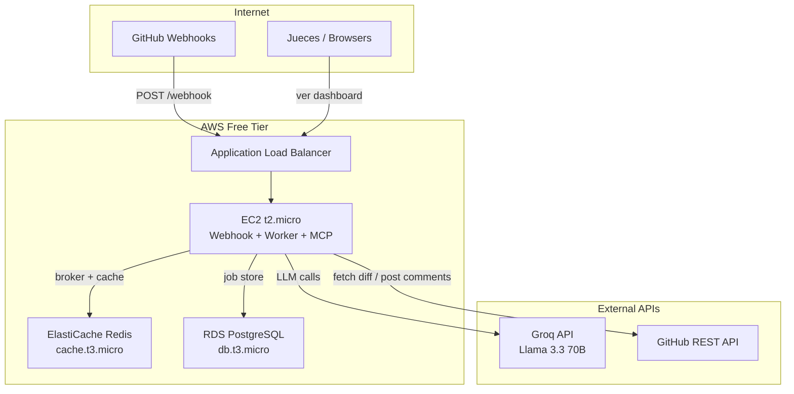

# 🚀 Deployment Guide — PR Guardian (AWS Free Tier)

Guía para desplegar PR Guardian en AWS.

---

## Arquitectura en AWS



---

## Opción A: EC2 Single Instance (Recomendada para hackathon)

Todo en una sola instancia `t2.micro` (750 hrs/mes gratis x 12 meses). Simple, rápido de montar, suficiente para la demo.

### Recursos AWS Free Tier

| Servicio | Tipo | Free Tier | Uso |
|----------|------|-----------|-----|
| EC2 | t2.micro | 750 hrs/mes | Webhook + Worker + MCP + Dashboard |
| EBS | gp3 | 30 GB | Disco del EC2 |
| ElastiCache | cache.t3.micro | 750 hrs/mes (12 meses) | Redis broker + cache |
| RDS | db.t3.micro PostgreSQL | 750 hrs/mes (12 meses) | Job Store (durable) |

> **RDS Free Tier:** 750 hrs/mes de `db.t3.micro` con 20 GB SSD + backups automáticos. PostgreSQL es la opción más pro y compatible.

### Setup paso a paso

#### 1. Lanzar EC2

```bash
# Desde AWS Console o CLI
aws ec2 run-instances \
  --image-id ami-0c02fb55956c7d316 \  # Amazon Linux 2023
  --instance-type t2.micro \
  --key-name tu-key-pair \
  --security-group-ids sg-xxx \
  --tag-specifications 'ResourceType=instance,Tags=[{Key=Name,Value=pr-guardian}]'
```

**Security Group — Inbound Rules:**

| Puerto | Protocolo | Source | Servicio |
|--------|-----------|--------|----------|
| 22 | TCP | Tu IP | SSH |
| 80 | TCP | 0.0.0.0/0 | HTTP (redirect a HTTPS) |
| 443 | TCP | 0.0.0.0/0 | HTTPS (webhook + dashboard) |

#### 2. Instalar dependencias en EC2

```bash
# Conectar
ssh -i tu-key.pem ec2-user@<public-ip>

# Instalar herramientas
sudo dnf install -y git redis6 nginx postgresql15
sudo systemctl enable --now redis6

# Instalar uv
curl -LsSf https://astral.sh/uv/install.sh | sh
source ~/.bashrc

# Instalar Node (para dashboard)
curl -fsSL https://fnm.vercel.app/install | bash
source ~/.bashrc
fnm install 20
```

#### 2.5. Crear RDS PostgreSQL

```bash
# Desde AWS CLI
aws rds create-db-instance \
  --db-instance-identifier pr-guardian-db \
  --db-instance-class db.t3.micro \
  --engine postgres \
  --engine-version 16.4 \
  --master-username pr_guardian \
  --master-user-password <PASSWORD_SEGURO> \
  --allocated-storage 20 \
  --publicly-accessible \
  --backup-retention-period 7 \
  --storage-type gp3

# Esperar a que esté disponible (~5 min)
aws rds wait db-instance-available --db-instance-identifier pr-guardian-db

# Obtener endpoint
aws rds describe-db-instances --db-instance-identifier pr-guardian-db \
  --query 'DBInstances[0].Endpoint.Address' --output text
```

**Security Group del RDS:**

| Puerto | Source | Descripción |
|--------|--------|-------------|
| 5432 | SG del EC2 | Solo acceso desde el EC2 |

Agrega la variable al `.env`:
```env
DATABASE_URL=postgresql://pr_guardian:<PASSWORD>@<RDS_ENDPOINT>:5432/pr_guardian
```

#### 3. Deploy del código

```bash
# Clonar
git clone git@github.com:kubos777/pr-guardian.git
cd pr-guardian
git checkout ft/async-review-pipeline

# Instalar dependencias
uv sync

# Dashboard
cd dashboard && npm install && npm run build && cd ..

# Crear .env
cp .env.example .env
nano .env  # llenar credenciales
```

#### 4. Configurar servicios con systemd

```bash
# /etc/systemd/system/pr-guardian-webhook.service
sudo tee /etc/systemd/system/pr-guardian-webhook.service << 'EOF'
[Unit]
Description=PR Guardian Webhook Handler
After=redis6.service

[Service]
Type=simple
User=ec2-user
WorkingDirectory=/home/ec2-user/pr-guardian
Environment=PYTHONPATH=/home/ec2-user/pr-guardian:/home/ec2-user/pr-guardian/agent-core:/home/ec2-user/pr-guardian/github-integration
ExecStart=/home/ec2-user/.local/bin/uv run uvicorn github_integration.webhook_handler:app --host 127.0.0.1 --port 8000
Restart=always

[Install]
WantedBy=multi-user.target
EOF

# /etc/systemd/system/pr-guardian-worker.service
sudo tee /etc/systemd/system/pr-guardian-worker.service << 'EOF'
[Unit]
Description=PR Guardian Celery Worker
After=redis6.service

[Service]
Type=simple
User=ec2-user
WorkingDirectory=/home/ec2-user/pr-guardian
Environment=PYTHONPATH=/home/ec2-user/pr-guardian:/home/ec2-user/pr-guardian/agent-core:/home/ec2-user/pr-guardian/github-integration
ExecStart=/home/ec2-user/.local/bin/uv run celery -A worker.celery_app worker --loglevel=info --concurrency=2
Restart=always

[Install]
WantedBy=multi-user.target
EOF

# /etc/systemd/system/pr-guardian-mcp.service
sudo tee /etc/systemd/system/pr-guardian-mcp.service << 'EOF'
[Unit]
Description=PR Guardian MCP Server
After=redis6.service

[Service]
Type=simple
User=ec2-user
WorkingDirectory=/home/ec2-user/pr-guardian
Environment=PYTHONPATH=/home/ec2-user/pr-guardian:/home/ec2-user/pr-guardian/agent-core:/home/ec2-user/pr-guardian/github-integration
ExecStart=/home/ec2-user/.local/bin/uv run python github-integration/server.py
Restart=always

[Install]
WantedBy=multi-user.target
EOF

# Activar todo
sudo systemctl daemon-reload
sudo systemctl enable --now pr-guardian-webhook pr-guardian-worker pr-guardian-mcp
```

#### 5. Reverse proxy con Caddy (HTTPS automático)

Caddy obtiene certificados SSL automáticamente vía Let's Encrypt.

```bash
# Instalar Caddy
sudo dnf install -y 'dnf-command(copr)'
sudo dnf copr enable -y @caddy/caddy
sudo dnf install -y caddy

# Configurar
sudo tee /etc/caddy/Caddyfile << 'EOF'
pr-guardian.tu-dominio.com {
    handle /webhook* {
        reverse_proxy localhost:8000
    }
    handle {
        reverse_proxy localhost:3000
    }
}
EOF

sudo systemctl enable --now caddy
```

> Si no tienes dominio, usa el IP público directamente con un certificado self-signed, o usa un subdominio gratis de https://freedns.afraid.org/

#### 6. Configurar webhook en GitHub

- **Payload URL:** `https://pr-guardian.tu-dominio.com/webhook`
- **Content type:** `application/json`
- **Secret:** El valor de `GITHUB_WEBHOOK_SECRET` en tu `.env`
- **Events:** Pull requests

---

## Opción B: Docker en EC2 (más portable)

Si prefieres usar Docker Compose en el EC2:

```bash
# Instalar Docker
sudo dnf install -y docker
sudo systemctl enable --now docker
sudo usermod -aG docker ec2-user

# Instalar docker-compose
sudo curl -L "https://github.com/docker/compose/releases/latest/download/docker-compose-$(uname -s)-$(uname -m)" -o /usr/local/bin/docker-compose
sudo chmod +x /usr/local/bin/docker-compose

# Deploy
cd pr-guardian
docker-compose up -d
```

---

## Costos estimados (12 meses)

| Servicio | Costo mensual |
|----------|---------------|
| EC2 t2.micro | $0 (free tier) |
| EBS 30GB gp3 | $0 (free tier) |
| RDS db.t3.micro PostgreSQL 20GB | $0 (free tier) |
| Redis en EC2 | $0 (instalado local) |
| Caddy + Let's Encrypt | $0 |
| Dominio (.dev) | ~$12/año (opcional) |
| Groq API | $0 (free tier, 30 RPM) |
| Gemini API (fallback) | $0 (free tier, 15 RPM) |
| **Total** | **$0** |

---

## Checklist pre-demo

- [ ] EC2 corriendo con los 3 servicios activos
- [ ] HTTPS configurado (Caddy + certificado)
- [ ] Webhook de GitHub apuntando al servidor
- [ ] `.env` con credenciales de producción
- [ ] PR de prueba funciona end-to-end
- [ ] Logs accesibles: `journalctl -u pr-guardian-webhook -f`
- [ ] Dashboard accesible desde browser
- [ ] Backup del `.env` en lugar seguro (no en el repo)

---

## Monitoring rápido

```bash
# Ver status de todos los servicios
sudo systemctl status pr-guardian-*

# Logs en tiempo real
journalctl -u pr-guardian-webhook -u pr-guardian-worker -u pr-guardian-mcp -f

# Verificar Redis
redis-cli info keyspace

# Verificar conexión a RDS
psql $DATABASE_URL -c "SELECT count(*) FROM jobs;"

# Ver jobs procesados
psql $DATABASE_URL -c "SELECT id, status, created_at FROM jobs ORDER BY created_at DESC LIMIT 5;"
```

---

## Diagrama de deploy

```
┌──────────────────────────────────────────────────┐
│ EC2 t2.micro (Amazon Linux 2023)                 │
│                                                  │
│  Caddy (:443) ─── reverse proxy ───┐             │
│                                    │             │
│  ┌────────────────────┐   ┌───────▼──────────┐  │
│  │ Webhook (:8000)    │   │ Dashboard (:3000)│  │
│  │ FastAPI + Uvicorn  │   │ Next.js          │  │
│  └────────┬───────────┘   └──────────────────┘  │
│           │ enqueue                              │
│  ┌────────▼───────────┐                         │
│  │ Redis (:6379)      │                         │
│  └────────┬───────────┘                         │
│           │ consume                              │
│  ┌────────▼───────────┐   ┌──────────────────┐  │
│  │ Celery Worker (x2) │──▶│ MCP Server       │  │
│  └────────────────────┘   │ (:8080, FastMCP) │  │
│                            └────────┬─────────┘  │
│                                     │            │
│  ┌──────────────────────────────────▼─────────┐  │
│  │ RDS PostgreSQL (db.t3.micro, 20GB)         │  │
│  │ Jobs, findings, history — durable state    │  │
│  └────────────────────────────────────────────┘  │
└──────────────────────────────────────────────────┘
         │                        │
         ▼                        ▼
   Groq / Gemini API       GitHub REST API
```
