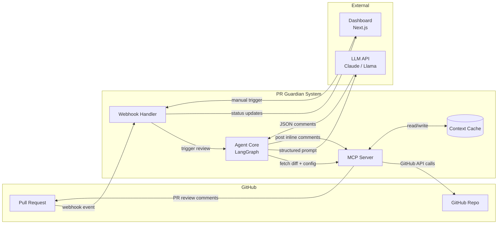

# 🛡️ PR Guardian

> Agente AI autónomo para code review inteligente de Pull Requests en GitHub.

PR Guardian no es un linter genérico. Es un reviewer que entiende **tu código**, **tu estilo** y **tu historial**. Analiza contexto real del repositorio, detecta patrones críticos y publica comentarios inline directamente en el PR — todo en menos de 30 segundos.

---

## ¿Por qué PR Guardian?

| Problema | Solución |
|----------|----------|
| Seniors quemados revisando estilo | El agente filtra lo trivial, el humano revisa arquitectura |
| Juniors repiten los mismos errores | Feedback contextualizado con referencias a fixes pasados |
| Reviews lentos bloquean releases | Respuesta automática en <30s post-push |
| Bugs críticos pasan a producción | Detección temprana de 5 patrones de alto impacto |

**Impacto cuantificable:**
- 40% reducción en tiempo de review humano
- 70% detección temprana de bugs críticos pre-merge
- Onboarding de juniors 3x más rápido

---

## Arquitectura



**Flujo principal:** Developer abre PR → GitHub dispara webhook → Handler obtiene diff + config vía MCP → Agent construye prompt estructurado → LLM devuelve JSON con comentarios → MCP publica inline comments en el PR.

📐 **[Diagramas de arquitectura detallados](./github-integration/ARCHITECTURE_DIAGRAMS.md)** — Incluye diagrama de secuencia, componentes y estados con explicaciones completas.

---

## Estructura del Proyecto

```
pr-guardian/
├── agent-core/              # El cerebro del agente
│   ├── prompts/             # System prompts versionados
│   ├── tools/               # MCP Tools customizadas
│   └── main.py              # Entry point del agente
├── github-integration/      # Conector GitHub (MCP + Webhooks)
│   ├── server.py            # Servidor MCP local/remoto
│   ├── webhook_handler.py   # Receptor de eventos GitHub
│   └── ARCHITECTURE_DIAGRAMS.md
├── dashboard/               # Frontend (Next.js + Tailwind)
│   ├── app/
│   └── components/
├── demo-repo/               # Repo de prueba pre-configurado (submodule)
├── EXECUTIVE_SUMMARY.md     # Pitch ejecutivo
├── REQUIREMENTS.md          # Requerimientos y criterios de aceptación
└── README.md
```

---

## Tech Stack

| Capa | Tecnología | Justificación |
|------|-----------|---------------|
| Agent Core | Python + LangGraph | Orquestación de grafos de estado, ideal para flujos con retry y branching |
| MCP Server | Python (FastMCP) | Protocolo estándar para exponer herramientas al LLM de forma desacoplada |
| LLM | Claude / Llama | Structured output (JSON), baja alucinación con temperature=0.2 |
| Dashboard | Next.js 14 + Tailwind | SSR para status real-time, deploy instantáneo en Vercel |
| Webhook | Python (async) | Event-driven, non-blocking, con retry exponencial |

---

## Detección de Patrones (MVP)

El agente detecta 5 categorías de issues críticos en repos TypeScript/Node.js:

1. **N+1 Queries** — Llamadas a DB dentro de loops
2. **Secrets Exposure** — API keys, tokens o credentials hardcodeados
3. **Null References** — Accesos sin null-check en cadenas opcionales
4. **Type Leaks** — `any` escapando a interfaces públicas
5. **Performance** — Re-renders innecesarios, imports pesados, operaciones O(n²)

---

## Getting Started

### Prerrequisitos

- Python 3.11+
- Node.js 20+
- Cuenta GitHub con permisos de webhook
- API key de un LLM (Claude o compatible)

### Instalación

```bash
# Clonar con submodules
git clone --recursive <repo-url>
cd pr-guardian

# Instalar dependencias raíz (activa Husky + commitlint)
npm install

# Agent Core
cd agent-core
python -m venv .venv
source .venv/bin/activate
pip install -r requirements.txt

# Dashboard
cd ../dashboard
npm install
```

> ⚠️ **Importante:** El `npm install` en la raíz es obligatorio. Instala los git hooks que validan tus commits.

### Variables de Entorno

```bash
cp .env.example .env
```

```env
# GitHub
GITHUB_WEBHOOK_SECRET=your_webhook_secret
GITHUB_TOKEN=ghp_your_personal_access_token

# LLM
LLM_API_KEY=your_api_key
LLM_MODEL=claude-sonnet-4-20250514
LLM_TEMPERATURE=0.2

# Server
MCP_SERVER_PORT=8080
DASHBOARD_URL=http://localhost:3000
```

### Ejecución

```bash
# Terminal 1: MCP Server + Webhook Handler
cd github-integration
python server.py

# Terminal 2: Dashboard
cd dashboard
npm run dev
```

---

## Git Conventions

Todos los miembros del equipo deben seguir estas reglas. Los commits se validan automáticamente con **commitlint + Husky** (se activan al hacer `npm install` en la raíz).

### Branches

Todas las ramas salen de `main`. Usar los siguientes prefijos:

| Prefijo | Uso | Ejemplo |
|---------|-----|---------|
| `ft/` | Nueva feature | `ft/agent-core-setup` |
| `hx/` | Hotfix urgente | `hx/webhook-timeout` |
| `fx/` | Bug fix no urgente | `fx/null-check-handler` |

```bash
# Crear una branch correctamente
git checkout main
git pull origin main
git checkout -b ft/mi-feature
```

### Commits

Formato obligatorio (en inglés):

```
type: short description
```

**Tipos permitidos:** `feat` · `fix` · `hotfix` · `docs` · `chore` · `refactor` · `test` · `style`

**Reglas:**
- Minúsculas después del `:`
- Sin punto final
- Máximo 72 caracteres
- Siempre en inglés

```bash
# ✅ Válidos
git commit -m "feat: add webhook handler for PR events"
git commit -m "fix: resolve null reference in diff parser"
git commit -m "docs: update architecture diagrams"

# ❌ Rechazados automáticamente
git commit -m "arreglé el bug"           # sin tipo, en español
git commit -m "Fix: Added something."    # mayúsculas, punto final
git commit -m "wip"                      # tipo inválido
```

> Si necesitas saltarte la validación (emergencia): `git commit --no-verify -m "msg"` — pero no abuses.

---

## Documentación

| Documento | Contenido |
|-----------|-----------|
| [Executive Summary](./EXECUTIVE_SUMMARY.md) | Pitch, propuesta de valor y diferenciadores |
| [Requirements](./REQUIREMENTS.md) | Alcance MVP, actores, criterios de aceptación |
| [Architecture Diagrams](./github-integration/ARCHITECTURE_DIAGRAMS.md) | Diagramas Mermaid: secuencia, componentes y estados |

---

## Roadmap (Post-Hackathon)

- [ ] Soporte multi-lenguaje (Python, Go, Rust)
- [ ] Auto-fix con sugerencias aplicables en un click
- [ ] Integración Slack/Teams para notificaciones
- [ ] Learning loop: feedback humano mejora el agente
- [ ] GitHub App instalable (OAuth flow completo)
- [ ] On-premise LLM para código enterprise sensible

---

## Equipo

Construido en el Hackaton Kiro by Código Fácilito

---

## Licencia

MIT
