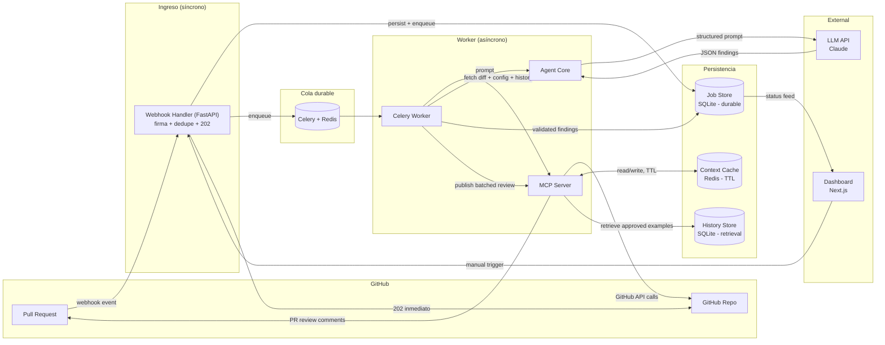

# 🛡️ PR Guardian

> Agente AI autónomo para code review inteligente de Pull Requests en GitHub.

PR Guardian no es un linter genérico. Es un reviewer que entiende **tu código**, **tu estilo** y **tu historial**. Analiza contexto real del repositorio, detecta patrones críticos y publica comentarios inline directamente en el PR — todo en menos de 30 segundos.

---

## ¿Por qué PR Guardian?

| Problema | Solución |
|----------|----------|
| Seniors quemados revisando estilo | El agente filtra lo trivial, el humano revisa arquitectura |
| Juniors repiten los mismos errores | Feedback contextualizado con referencias a fixes pasados |
| Reviews lentos bloquean releases | Respuesta automática en <30s post-push |
| Bugs críticos pasan a producción | Detección temprana de 5 patrones de alto impacto |

**Impacto cuantificable:**
- 40% reducción en tiempo de review humano
- 70% detección temprana de bugs críticos pre-merge
- Onboarding de juniors 3x más rápido

---

## Arquitectura

PR Guardian es un pipeline **asíncrono y durable**: el webhook responde `202` de inmediato (firma validada, evento deduplicado, job persistido y encolado) y todo el trabajo real — fetch de contexto, análisis LLM, validación y publicación — ocurre después, en un worker de Celery, con reintentos acotados por etapa.



**Flujo principal:** Developer abre/actualiza un PR → GitHub dispara webhook → Handler valida firma, deduplica y responde `202` → Celery entrega el job a un worker → worker obtiene diff/config/historial vía MCP → construye prompts y llama al LLM → valida cada hallazgo contra el diff real → confirma que el head_sha sigue vigente → publica los comentarios inline en un solo review batched.

📐 **[Diagramas de arquitectura detallados](./github-integration/ARCHITECTURE_DIAGRAMS.md)** — Incluye diagrama de secuencia, componentes y estados con explicaciones completas.

---

## Estructura del Proyecto

```
pr-guardian/
├── agent-core/               # El cerebro del agente (sin estado, sin Celery/GitHub)
│   ├── prompts/              # System prompts versionados
│   ├── schemas.py            # Contratos Pydantic (Finding unificado + salidas crudas del LLM)
│   ├── diff_utils.py         # Parseo de unified diff -> líneas comentables
│   ├── fingerprint.py        # Fingerprint determinista + marcador de idempotencia
│   ├── exceptions.py         # LLMTransientError / LLMFatalError
│   └── main.py               # analyze() / validate_against_diff() / to_finding_dicts()
├── github-integration/        # Conector GitHub (MCP + Webhook ingress)
│   ├── server.py              # MCP Server: tools de fetch de contexto + publish_review
│   ├── github_client.py       # Cliente REST de GitHub con clasificación de errores
│   ├── webhook_handler.py     # FastAPI: firma, dedupe, persist + enqueue, 202
│   └── ARCHITECTURE_DIAGRAMS.md
├── worker/                    # Pipeline Celery (requisito async/durable)
│   ├── celery_app.py          # App Celery (broker Redis)
│   ├── tasks.py                # fetch_context_task -> analyze_task -> validate_task -> publish_task
│   ├── base.py                 # StageTask: persiste FAILED en el Job Store
│   ├── mcp_client.py           # Cliente MCP in-memory usado por el worker
│   └── exceptions.py           # RetryableError / NonRetryableError
├── store/                     # Persistencia (tres capas, conceptualmente separadas)
│   ├── db.py                   # Conexión SQLite + schema (WAL)
│   ├── job_store.py            # Job Store: estado durable, dedupe, job_events, findings
│   ├── context_cache.py        # Context Cache: Redis con TTL
│   └── history_store.py        # History Store: retrieval de ejemplos aprobados
├── data/                       # data/*.db (SQLite Job Store) - gitignored
├── tests/                      # Suite de verificación offline (sin Redis/GitHub/LLM reales)
├── dashboard/                  # Frontend (Next.js + Tailwind)
│   ├── app/
│   └── components/
├── demo-repo/                  # Repo de prueba pre-configurado (submodule)
├── requirements.txt            # Dependencias Python compartidas
├── .env.example
├── EXECUTIVE_SUMMARY.md        # Pitch ejecutivo
├── REQUIREMENTS.md             # Requerimientos y criterios de aceptación
└── README.md
```

---

## Tech Stack

| Capa | Tecnología | Justificación |
|------|-----------|---------------|
| Webhook Handler | Python (FastAPI) | Valida firma + deduplica + responde 202 sin bloquear en I/O externo |
| Queue / Broker | Celery + Redis | Orquesta las etapas del pipeline con reintentos, backoff y jitter por etapa (no en memoria de un solo proceso) |
| Job Store | SQLite (`data/pr_guardian.db`) | Estado de ejecución durable — sobrevive a un reinicio de Redis o del worker |
| Context Cache | Redis (TTL) | Respuestas de GitHub de corta vida; perderlas no afecta la corrección |
| History Store | SQLite (`history_examples`) | Ejemplos históricos aprobados que se **recuperan**, no se aprenden automáticamente en el MVP |
| Agent Core | Python (sin estado) | Construye prompts, llama al LLM, valida y normaliza hallazgos — no conoce Celery ni GitHub |
| MCP Server | Python (FastMCP) | Protocolo estándar para exponer el acceso a GitHub como herramientas desacopladas |
| LLM | Claude | Structured output (JSON), baja alucinación con temperature=0.2 |
| Dashboard | Next.js 14 + Tailwind | SSR para status real-time, deploy instantáneo en Vercel |

> **Nota de arquitectura:** la orquestación con estado y reintentos que originalmente se planteó como un grafo en proceso (LangGraph) ahora vive en Celery — es durable entre reinicios y permite reintentar una sola etapa sin repetir las anteriores. `agent-core` quedó como una biblioteca de análisis sin estado a propósito.

---

## Detección de Patrones (MVP)

El agente detecta 5 categorías de issues críticos en repos TypeScript/Node.js:

1. **N+1 Queries** — Llamadas a DB dentro de loops
2. **Secrets Exposure** — API keys, tokens o credentials hardcodeados
3. **Null References** — Accesos sin null-check en cadenas opcionales
4. **Type Leaks** — `any` escapando a interfaces públicas
5. **Performance** — Re-renders innecesarios, imports pesados, operaciones O(n²)

---

## Getting Started

### Prerrequisitos

- Python 3.11+
- Node.js 20+
- **Redis** corriendo localmente (broker de Celery + Context Cache) — `redis-server`, Docker, o cualquier instancia accesible por `REDIS_URL`
- Cuenta GitHub con permisos de webhook
- API key de un LLM (Claude o compatible)

### Instalación

```bash
# Clonar con submodules
git clone --recursive <repo-url>
cd pr-guardian

# Instalar dependencias raíz (activa Husky + commitlint)
npm install

# Dependencias Python compartidas (webhook, worker, MCP server, agent-core)
python -m venv .venv
source .venv/bin/activate   # Windows: .venv\Scripts\activate
pip install -r requirements.txt

# Dashboard
cd dashboard
npm install
cd ..
```

> ⚠️ **Importante:** El `npm install` en la raíz es obligatorio. Instala los git hooks que validan tus commits.

### Variables de Entorno

```bash
cp .env.example .env
```

```env
# GitHub
GITHUB_WEBHOOK_SECRET=your_webhook_secret
GITHUB_TOKEN=ghp_your_personal_access_token

# LLM
LLM_API_KEY=your_anthropic_api_key
LLM_MODEL=claude-sonnet-4-20250514
LLM_TEMPERATURE=0.2

# Queue / Broker + Context Cache
REDIS_URL=redis://localhost:6379/0
CELERY_BROKER_URL=redis://localhost:6379/0

# Job Store (SQLite)
PR_GUARDIAN_DB_PATH=data/pr_guardian.db

# Server
MCP_SERVER_PORT=8080
DASHBOARD_URL=http://localhost:3000
```

Ver [.env.example](./.env.example) para la lista completa (incluye la política de reintentos: `MAX_RETRY_ATTEMPTS`, `RETRY_BACKOFF_BASE_SECONDS`, `RETRY_BACKOFF_MAX_SECONDS`).

### Ejecución

El pipeline corre en tres procesos independientes (más el dashboard):

```bash
# Terminal 1: Redis (si no lo tienes como servicio)
redis-server

# Terminal 2: Celery Worker — ejecuta fetch/analyze/validate/publish
celery -A worker.celery_app worker --loglevel=info

# Terminal 3: Webhook Handler (FastAPI) — recibe eventos de GitHub
cd github-integration
python webhook_handler.py

# Terminal 4: Dashboard
cd dashboard
npm run dev
```

El MCP Server (`github-integration/server.py`) no se ejecuta como proceso aparte en el MVP: el worker lo usa como una librería en memoria (`worker/mcp_client.py`) para no pagar un segundo salto de red en cada fetch de contexto. Puede levantarse standalone (`python server.py`, transporte stdio) para depurarlo con cualquier cliente MCP.

Para inicializar el schema del Job Store manualmente (opcional — se crea automáticamente al primer uso):

```bash
python -m store.db
```

---

## Git Conventions

Todos los miembros del equipo deben seguir estas reglas. Los commits se validan automáticamente con **commitlint + Husky** (se activan al hacer `npm install` en la raíz).

### Branches

Todas las ramas salen de `main`. Usar los siguientes prefijos:

| Prefijo | Uso | Ejemplo |
|---------|-----|---------|
| `ft/` | Nueva feature | `ft/agent-core-setup` |
| `hx/` | Hotfix urgente | `hx/webhook-timeout` |
| `fx/` | Bug fix no urgente | `fx/null-check-handler` |

```bash
# Crear una branch correctamente
git checkout main
git pull origin main
git checkout -b ft/mi-feature
```

### Commits

Formato obligatorio (en inglés):

```
type: short description
```

**Tipos permitidos:** `feat` · `fix` · `hotfix` · `docs` · `chore` · `refactor` · `test` · `style`

**Reglas:**
- Minúsculas después del `:`
- Sin punto final
- Máximo 72 caracteres
- Siempre en inglés

```bash
# ✅ Válidos
git commit -m "feat: add webhook handler for PR events"
git commit -m "fix: resolve null reference in diff parser"
git commit -m "docs: update architecture diagrams"

# ❌ Rechazados automáticamente
git commit -m "arreglé el bug"           # sin tipo, en español
git commit -m "Fix: Added something."    # mayúsculas, punto final
git commit -m "wip"                      # tipo inválido
```

> Si necesitas saltarte la validación (emergencia): `git commit --no-verify -m "msg"` — pero no abuses.

---

## Documentación

| Documento | Contenido |
|-----------|-----------|
| [Executive Summary](./EXECUTIVE_SUMMARY.md) | Pitch, propuesta de valor y diferenciadores |
| [Requirements](./REQUIREMENTS.md) | Alcance MVP, actores, criterios de aceptación |
| [Architecture Diagrams](./github-integration/ARCHITECTURE_DIAGRAMS.md) | Diagramas Mermaid: secuencia, componentes y estados |

---

## Roadmap (Post-Hackathon)

- [ ] Soporte multi-lenguaje (Python, Go, Rust)
- [ ] Auto-fix con sugerencias aplicables en un click
- [ ] Integración Slack/Teams para notificaciones
- [ ] Learning loop: feedback humano mejora el agente
- [ ] GitHub App instalable (OAuth flow completo)
- [ ] On-premise LLM para código enterprise sensible

---

## Equipo

Construido en el Hackaton Kiro by Código Fácilito

---

## Licencia

MIT
