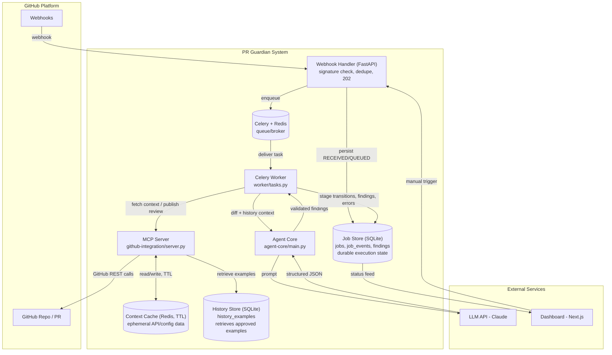
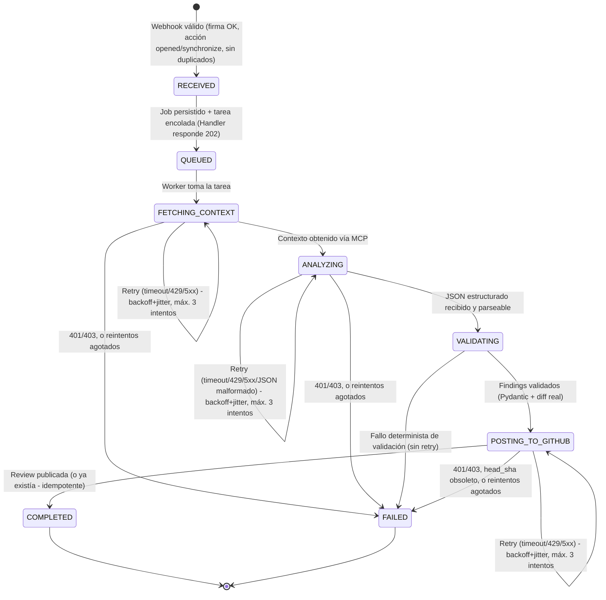

# 🛡️ PR Guardian - Documentación de Arquitectura y Diagramas

Este documento explica los diagramas técnicos del proyecto PR Guardian, actualizados para reflejar el pipeline de revisión **asíncrono y durable** implementado con FastAPI + Celery/Redis + SQLite. Úsalos como referencia durante el desarrollo y para preparar el pitch técnico ante los jueces.

---

## 1. Diagrama de Flujo Principal (Secuencia)

### Descripción

Este diagrama muestra la **interacción temporal** completa: desde que GitHub dispara el webhook hasta que el review queda publicado, incluyendo el ACK asíncrono inmediato y el trabajo real ejecutado por el worker.

```mermaid
sequenceDiagram
    participant Dev as Developer
    participant GH as GitHub
    participant WH as Webhook Handler (FastAPI)
    participant JS as Job Store (SQLite)
    participant Q as Celery + Redis
    participant W as Celery Worker
    participant MCP as MCP Server
    participant CC as Context Cache (Redis, TTL)
    participant HS as History Store (SQLite)
    participant LLM as LLM (Claude)

    Dev->>GH: Push / open Pull Request
    GH->>WH: POST /webhook (pull_request.opened|synchronize)
    WH->>WH: Validar X-Hub-Signature-256 (rechaza si inválida, antes de parsear)
    WH->>JS: Dedupe (X-GitHub-Delivery) + Dedupe (repo+pr+head_sha) + INSERT job RECEIVED
    WH->>Q: enqueue fetch_context_task(job_id); job -> QUEUED
    WH-->>GH: 202 Accepted (inmediato, antes de tocar GitHub/LLM)

    Q->>W: fetch_context_task(job_id)
    W->>JS: job -> FETCHING_CONTEXT
    W->>MCP: get_pr_files / get_repo_config / get_history_examples
    MCP->>CC: cache lookup (miss)
    MCP->>GH: GET .../pulls/{n}/files, GET .../contents/{config}
    MCP->>CC: cache store (TTL)
    MCP->>HS: retrieve approved historical examples (no aprendizaje)
    MCP-->>W: files + config + history

    W->>JS: job -> ANALYZING
    W->>LLM: prompts (style/security/history) sobre diff envuelto como <untrusted_repository_content>
    LLM-->>W: 3x JSON estructurado (o error -> retry con backoff+jitter)

    W->>JS: job -> VALIDATING
    W->>W: Pydantic Finding + cross-check contra líneas reales del diff (sin retry: fallo determinista)
    W->>JS: persist findings (con fingerprint)

    W->>JS: job -> POSTING_TO_GITHUB
    W->>MCP: get_pr_head_sha (fresco, sin caché)
    alt head_sha cambió
        W->>JS: job -> FAILED (stale analysis, sin retry)
    else head_sha coincide
        W->>MCP: list_reviews (chequeo de marcador de idempotencia)
        W->>MCP: publish_review (POST .../pulls/{n}/reviews, comentarios batched)
        MCP->>GH: crea review con inline comments
        GH-->>Dev: Notificación de nuevos comentarios
        W->>JS: job -> COMPLETED (github_review_id + fingerprint_set_hash)
    end
```

### Explicación Detallada

1. **Trigger:** el developer abre o actualiza (`synchronize`) un PR. Ninguna otra acción de `pull_request` es procesada.
2. **Ingreso síncrono, mínimo:** el Webhook Handler valida la firma HMAC **antes** de parsear el JSON, deduplica por `X-GitHub-Delivery` y por `(repository_id, pr_number, head_sha)`, persiste el job en el Job Store y encola la primera tarea — todo antes de responder `202`. Ninguna llamada a GitHub o al LLM ocurre en este proceso.
3. **Cola durable:** Celery + Redis desacoplan el ACK de la ejecución real. Si el worker está ocupado o se reinicia, el job sigue en la cola (`acks_late`, prefetch=1).
4. **Fetch de contexto vía MCP:** el worker nunca llama a la API de GitHub directamente — siempre a través del MCP Server, que además cachea respuestas de solo-lectura en el Context Cache (TTL) y recupera ejemplos históricos aprobados desde el History Store.
5. **Análisis:** el LLM recibe el diff y el contexto histórico marcados explícitamente como **datos no confiables** (nunca instrucciones). La respuesta es JSON estructurado; un JSON malformado se reintenta igual que un timeout/429/5xx.
6. **Validación determinista:** cada hallazgo se valida con Pydantic y se descarta si su `path`+`line` no existe en el diff actual. Esta etapa nunca se reintenta — un fallo aquí es definitivo.
7. **Publicación con doble chequeo de frescura e idempotencia:** justo antes de publicar, se vuelve a pedir el head_sha real del PR (sin caché). Si cambió, el job falla sin reintentar (el análisis quedó obsoleto). Si coincide, se revisa si ya existe una review con el mismo fingerprint-set antes de publicar una nueva.

### 💡 Por qué importa para ganar

- Demuestra **ACK asíncrono real**: GitHub recibe `202` en milisegundos, no al terminar el análisis.
- Muestra que el agente **nunca opina sin consultar contexto explícito**, y que ese contexto pasa por una capa de caché con TTL claramente separada del estado durable.
- Justifica MCP como la única puerta hacia GitHub: si cambia la API de GitHub, solo se toca `github-integration/`.

---

## 2. Diagrama de Arquitectura de Componentes

### Descripción

Vista **estructural estática**: los módulos del sistema, sus responsabilidades y las tres capas de persistencia — deliberadamente separadas — que sostienen el pipeline.



### Explicación Detallada

- **GitHub Platform:** entorno externo — origen de los eventos y destino final de los comentarios.
- **Webhook Handler:** el único componente que habla HTTP público. Valida, deduplica, persiste y encola; nunca llama a GitHub ni al LLM.
- **Celery + Redis:** cola/broker durable (requisito #6). Desacopla el ACK HTTP de la ejecución.
- **Celery Worker:** ejecuta las etapas `FETCHING_CONTEXT -> ANALYZING -> VALIDATING -> POSTING_TO_GITHUB` como tareas independientes encadenadas, cada una con su propia política de reintentos.
- **MCP Server:** la única puerta hacia la API de GitHub. Expone herramientas (`get_pr_files`, `get_pr_head_sha`, `get_repo_config`, `get_history_examples`, `publish_review`, `list_reviews`).
- **Agent Core:** biblioteca sin estado — construye prompts, llama al LLM, valida y normaliza los hallazgos. No conoce Celery ni GitHub directamente.
- **Job Store (SQLite):** fuente de verdad del estado de ejecución — sobrevive a un reinicio de Redis.
- **Context Cache (Redis, TTL):** datos de API/config de corta vida. Perderlos no cambia la corrección del sistema, solo obliga a re-consultar GitHub.
- **History Store (SQLite):** ejemplos históricos aprobados que se **recuperan** para enriquecer el contexto — el MVP no aprende ni actualiza este store automáticamente.

### 💡 Por qué importa para ganar

- Tres almacenes con **propósitos distintos y explícitos** (durable / efímero con TTL / retrieval curado) — no un cajón único de "estado".
- El worker nunca toca GitHub o Redis directamente para contexto: siempre vía MCP — separación real de responsabilidades.
- Escalar el número de PRs concurrentes es escalar workers de Celery, no reescribir el webhook.

---

## 3. Diagrama de Estados del Job

### Descripción

Ciclo de vida completo de un job de revisión, con las transiciones exactas que implementa `worker/tasks.py` y persiste `store/job_store.py` como un `job_event` en cada cambio.



### Explicación Detallada

| Etapa | Qué hace | Política de reintentos |
|-------|----------|-------------------------|
| `RECEIVED` | Webhook validado y persistido | n/a |
| `QUEUED` | Tarea encolada en Celery/Redis | n/a |
| `FETCHING_CONTEXT` | Diff, config e historial vía MCP | timeout/429/5xx -> retry; 401/403 -> falla |
| `ANALYZING` | Prompt a LLM, parseo de JSON | timeout/429/5xx/JSON malformado -> retry; 401/403 -> falla |
| `VALIDATING` | Pydantic + cross-check contra el diff | **sin retry** — fallo determinista |
| `POSTING_TO_GITHUB` | Confirma head_sha, publica review batched | timeout/429/5xx -> retry; 401/403 o head_sha obsoleto -> falla |
| `COMPLETED` | `github_review_id` y `fingerprint_set_hash` guardados | terminal |
| `FAILED` | Error persistido en `jobs.error` | terminal |

Cada intento (exitoso o no) incrementa `jobs.attempt_counts[stage]` y agrega una fila a `job_events` — el dashboard puede reconstruir el historial completo de un job sin depender de los logs del worker.

### Manejo de Errores

- **Retry por etapa, no por pipeline completo:** cada etapa es su propia tarea de Celery; reintentar `POSTING_TO_GITHUB` nunca vuelve a ejecutar `ANALYZING`.
- **Máximo 3 intentos, backoff exponencial + jitter** (`retry_backoff=True, retry_jitter=True, max_retries=3` en `worker/tasks.py`).
- **401/403 y fallos deterministas nunca se reintentan** — serían idénticos en el intento siguiente.
- **GitHub no reentrega webhooks fallidos automáticamente** — la idempotencia depende enteramente de `X-GitHub-Delivery` y de `(repository_id, pr_number, head_sha)`, no de un reintento del lado de GitHub.
- **Idempotencia de publicación:** antes de publicar se busca un job `COMPLETED` con el mismo fingerprint-set y, como capa adicional, se listan las reviews existentes buscando el marcador embebido — así una publicación exitosa seguida de un crash no produce una review duplicada.

### 💡 Por qué importa para ganar

- El estado nunca vive solo en la memoria de un proceso — sobrevive a un reinicio del worker o de Redis.
- La distinción retry/no-retry está codificada explícitamente (`RetryableError` vs `NonRetryableError`), no inferida a mano en cada bloque `except`.
- Un juez puede matar el proceso worker a mitad de una review y ver que el job se retoma en la etapa correcta al reiniciarlo, no desde cero.

---

## 🎯 Cómo Usar Estos Diagramas en el Hackathon

| Momento | Diagrama a Usar | Propósito |
|---------|-----------------|-----------|
| Kickoff del equipo | Arquitectura de Componentes | Asignar tareas y entender dependencias |
| Daily Standup | Flujo Principal | Verificar que estamos avanzando en la secuencia correcta |
| Debugging | Estados del Job | Identificar en qué etapa se atasca un job (`job_events`) |
| Pitch Técnico | Los 3 juntos | Mostrar profundidad de diseño y pensamiento sistémico |
| Q&A con Jueces | Estados + Componentes | Responder preguntas sobre robustez, durabilidad e idempotencia |

---

## ⚠️ Notas Importantes para el Equipo

- **Los diagramas son vivos:** si cambia el pipeline, se actualizan estos diagramas en el mismo PR — documentación desactualizada es deuda técnica.
- **Mermaid en GitHub:** se renderiza nativamente, no requiere imágenes.
- **Terminología:** este documento nunca dice que el agente "aprende" — dice que **recupera ejemplos históricos aprobados** (History Store). Ver `store/history_store.py`.
